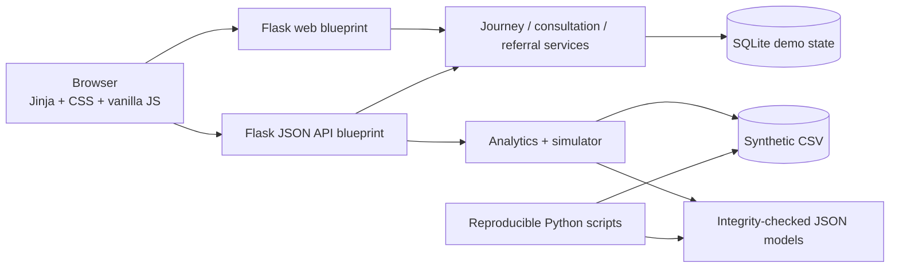

# AstroLive Orbit

**From one-time consultation to continuous guidance.**

AstroLive Orbit is OrbitWorks’ working AstroHack 2026 prototype. It connects a small daily reflection ritual to a user-approved human consultation brief, demo booking, consented follow-up, privacy-safe referral loop, and an operator Growth Cockpit. Machine learning estimates product behavior on synthetic data; it never presents astrology as scientifically validated and never replaces an astrologer’s judgment.

- Team: OrbitWorks
- Team leader: Yatharth Garg
- Hackathon: AstroHack 2026 — Build the Next Universe
- Required report: `submission/AstroLive_OrbitWorks_YatharthGarg.pdf` — generated and structurally verified at 12 pages; final rendered-page visual inspection pending

## Why Orbit

AstroLive’s public experience already spans consultations, horoscopes, reports, Kundli utilities, live sessions, pooja booking, and commerce. The opportunity is not another directory, horoscope page, chatbot, or upsell engine. Orbit demonstrates one measurable loop:

```text
daily Pulse → consultation readiness → approved Bridge brief → human guidance
     ↑                                                        ↓
trusted Circle invite ← continued Journey and follow-up ← user-approved actions
```

The distinction is continuity. Pulse creates a voluntary return ritual; Bridge helps a human astrologer begin with context; follow-up carries value beyond a transaction; Circle makes referral value mutual and consent-gated; the Cockpit makes assumptions and outcomes inspectable.

## Working product journey

- **Landing and onboarding:** minimum demo profile, deterministic sun sign, separate journey-saving and optional Circle consent.
- **Orbit Pulse:** mood/confidence input, deterministic reflection and safe micro-action, explanation, feedback, streak, and weekly state.
- **Orbit Bridge:** editable goal/context/questions, urgency without pressure, language/mode, optional prior check-ins, and transparent specialty suggestion.
- **Demo booking:** clearly marked sample astrologers, prices, modes, and confirmation; no real charge or AstroLive booking.
- **Astrologer Console:** approved brief plus only the check-in context the user agreed to share.
- **Follow-up and Journey:** approved summary, one to three actions, a stored check-in date, helpfulness, timeline, completion, and current-session reset.
- **Orbit Circle:** cryptographically random, expiring invitation; no private details in the URL; independent invitee consent; atomic single-use completion; only a broad conversation preference is requested; mutual insight only after both sides consent.
- **Growth Cockpit:** synthetic activity, retention, funnel, consultation, referral/K-factor, segments, model distributions, evidence, filters, and anonymized drill-down.
- **Experiment Simulator:** at least 10,000 reproducible Monte Carlo trials, uncertainty intervals, sensitivity ranking, and JSON/CSV export. Outputs are scenario estimates, never measured impact.

## Screenshots

Curated desktop and 360 px mobile screenshots are pending the final browser-QA pass. No placeholder images or unverified screenshots are embedded here. The final repository should retain only the selected screenshots used in the report.

## Architecture



The application uses a Flask factory, modular blueprints, explicit service functions, parameterized `sqlite3`, pandas/NumPy analytics, and scikit-learn training. Deployed inference reads fixed-schema JSON coefficients only after SHA-256 verification; it does not load pickle or executable model objects. See [Architecture](docs/ARCHITECTURE.md).

## Data and model evidence

No organizer behavioral dataset was present when the pipeline was built. `data/demo/synthetic_orbit_users.csv` therefore contains **2,400 fictional snapshots**, generated with seed 2026 across 2026-01-01 through 2026-07-31. It contains no real AstroLive users, names, contacts, birth details, free text, or measured business outcomes.

Two behavioral targets use a chronological date-boundary split with 1,411 training, 507 validation, and 482 test rows (approximately 60/20/20). Logistic regression is compared with a class-balanced random forest on validation PR-AUC; the interpretable logistic model is selected only inside a predefined 0.02 equivalence margin. Thresholds are chosen on validation cost, never test labels.

| Synthetic task | Selected model | Threshold | Test PR-AUC | ROC-AUC | Precision | Recall | F1 | Brier |
|---|---|---:|---:|---:|---:|---:|---:|---:|
| Future 30-day churn risk | Logistic regression | 0.18 | 0.6077 | 0.6939 | 0.4242 | 0.9949 | 0.5948 | 0.2130 |
| Future 14-day consultation intent | Logistic regression | 0.27 | 0.3459 | 0.7196 | 0.3056 | 0.3587 | 0.3300 | 0.1437 |

These are reproducible **synthetic holdout metrics**, not claims about production accuracy. Both models have modest discrimination/precision and remain demonstration evidence, not deployment-ready targeting. The churn threshold intentionally favors recall at the cost of many false positives. Missing or invalid artifacts produce a no-action fallback. See the model card and data audit once finalized, plus `artifacts/models/evaluation.json` for machine-readable results.

## Quick start

Python 3.11 or newer is required.

### Windows

```bat
py -m venv .venv
.venv\Scripts\activate
python -m pip install -r requirements.txt
python run.py
```

PowerShell users whose execution policy blocks the activation shim can run `.venv\Scripts\Activate.ps1` or invoke `.venv\Scripts\python.exe` directly.

### macOS and Linux

```bash
python3 -m venv .venv
source .venv/bin/activate
python -m pip install -r requirements.txt
python run.py
```

Open http://127.0.0.1:5000 and use `/api/health` for a machine-readable database and integrity-checked model health report. Startup creates `instance/orbit.db` idempotently. This is server-side SQLite storage, not browser/device-local storage. If `ORBIT_SECRET_KEY` is absent, the app generates an ephemeral development key and logs a warning; set a stable random secret in production.

## Reproduce data and models

Install development dependencies, then regenerate in this order:

```bash
python -m pip install -r requirements-dev.txt
python scripts/generate_demo_data.py
python scripts/train_models.py
```

Both scripts use seed 2026 by default. Regeneration replaces the public synthetic CSV and model/evaluation artifacts; review the diff before committing.

## Tests and verification

The repository’s required verification commands are:

```bash
python -m pytest -q
python -m compileall -q app scripts run.py
python -m ruff check app scripts tests run.py
gunicorn --bind 127.0.0.1:8000 --workers 1 --threads 2 run:app
```

On Windows, use Waitress for the production-style smoke test because Gunicorn does not run natively there:

```bat
waitress-serve --listen=127.0.0.1:8000 --call app:create_app
```

Current local results on 2026-08-20: **68 pytest tests passed in 22.47 seconds** in the project virtual environment, Ruff passed, Python compilation passed, the repository secret scan found no findings across 86 scanned text files, and a Waitress factory smoke returned HTTP 200 for `/` with a healthy database response from `/api/health`. The exact-name PDF was generated at 12 pages and its verifier found all 22 required sections with no blank-page candidates. Linux/Render Gunicorn smoke, browser-smoke, and rendered-page PDF visual inspection remain pending and must be recorded in [Submission Checklist](docs/SUBMISSION_CHECKLIST.md) after they are actually run.

## Main routes and APIs

Product pages: `/`, `/onboarding`, `/pulse`, `/bridge`, `/booking`, `/console`, `/follow-up`, `/circle`, `/journey`, `/growth`, `/experiments`, and `/privacy`.

JSON APIs include `/api/health`, check-ins and feedback, briefs, bookings, follow-up, Circle consent/referrals/completion, action completion, reset, analytics, simulator runs, and JSON/CSV simulator downloads. All mutating requests, including progressive HTML onboarding, require the per-session CSRF token; reset additionally requires explicit confirmation. A stable random session-owner nonce scopes simulator rows and private/no-store downloads, including anonymous pre-onboarding runs. API validation, 404, 405, 413, and server errors use a consistent `{ok: false, error: ...}` shape.

## Security, privacy, and responsible use

- Parameterized SQL, foreign keys, input length/choice validation, 64 KiB request limit, CSRF checks, private/no-store owner pages, security headers, secure-cookie option, safe error responses, and lightweight referral rate limiting.
- Random 32-byte URL-safe referral tokens expire after seven days. Invite URLs contain no birth details, concern, focus, or user identifier. Consent changes and link creation are serialized; completion is a conditional single-winner update, and losing/replayed requests receive redacted status.
- Journey saving, Circle sharing, consultation-context sharing, and invitee completion are distinct choices. While its signed session remains available, the demo can delete that session’s experiment runs, server-side user, and cascaded journey.
- Reflections are deterministic, explain why they were shown, and avoid fatalistic, medical, legal, or investment instructions.
- ML estimates engagement/intent behavior only. It must not infer destiny, compatibility, mental health, protected traits, or suitability for credit/employment/insurance.

See [Privacy and Ethics](docs/PRIVACY_AND_ETHICS.md).

## Deployment

### Render Blueprint

1. Push this repository to GitHub.
2. In Render, create a Blueprint and select the repository; Render reads `render.yaml`.
3. Confirm the generated `ORBIT_SECRET_KEY`, Python 3.11.11, start command, and `/api/health` check.
4. Deploy, then exercise the full demo on the public URL.

The Blueprint intentionally uses `/tmp/orbit.db` on the free service. **That filesystem is ephemeral: demo journeys disappear on restart, redeploy, or reschedule.** For persistent multi-instance use, attach a Render persistent disk mounted at `/var/data`, change `ORBIT_DATABASE` to `/var/data/orbit.db`, use a paid disk-compatible service, and keep a single web worker for SQLite writes—or migrate to a managed database before production. Render documents Flask/Gunicorn deployment, health checks, and the rule that only files under a disk mount persist: [Flask deployment](https://render.com/docs/deploy-flask), [health checks](https://render.com/docs/health-checks), [persistent disks](https://render.com/docs/disks).

The prototype session expires after eight hours and has no login or recovery. If that signed cookie is lost while server-side rows survive, the UI cannot reconnect the user to retrieve or delete them. This known limitation is another reason the supplied configuration is a demonstration, not a production data-retention design.

### Docker

```bash
docker build -t astrolive-orbit .
docker run --rm -p 5000:5000 -e ORBIT_SECRET_KEY=replace-me astrolive-orbit
```

Mount a host directory at `/app/instance` if local Docker demo state should survive container replacement.

No public deployment URL is claimed until a deployment has been authorized and verified.

## Repository guide

```text
app/                  Flask app, routes, services, analytics, ML inference, UI
artifacts/models/     Small JSON models, SHA-256 digests, evaluation evidence
data/demo/            Public, explicitly synthetic behavioral data
docs/                 Research, architecture, audit, ethics, model, demo docs
scripts/              Reproducible data, training, report, evaluation scripts
submission/           Final exact-name 12-page PDF
tests/                Automated service, route, security, analytics, and ML tests
run.py                Development and WSGI entrypoint
```

## Three-minute judge path

Start at `/`, onboard with save consent, complete Pulse, build and approve a Bridge brief, create the sample booking, show the consent-filtered Console, save follow-up, create and complete a Circle invite in a private window, review Journey, open Growth, and run the simulator. The timed narration is in [Demo Script](docs/DEMO_SCRIPT.md).

## Limitations

- All analytics and ML outcomes are synthetic demonstrations; none describe real AstroLive customers.
- The prototype does not calculate a complete Kundli or planetary chart. It calculates only a deterministic sun sign from date boundaries.
- Sample astrologers, availability, prices, bookings, revenue assumptions, and impact scenarios are fictional/demo inputs.
- SQLite is appropriate for a local/single-instance prototype, not horizontally scaled production writes.
- The project has not been integrated with AstroLive accounts, payments, messaging, calendars, or production data.
- Final screenshots, public deployment, lint/browser/Gunicorn verification, and rendered-page report visual inspection remain pending at this documentation snapshot.

## Research and AI disclosure

Public-source observations and inferences are separated in [Product Teardown](docs/PRODUCT_TEARDOWN.md), with every opened source listed in [References](docs/REFERENCES.md).

OpenAI ChatGPT was used for product ideation, research synthesis, and master-prompt preparation. OpenAI Codex was used for implementation, testing, debugging, documentation, and report production. AI output is not treated as evidence: source claims are checked against opened pages, code behavior is verified through tests and browser flows, model statements are tied to generated artifacts, and the final PDF must be text-extracted and visually inspected page by page before submission.

## License

Released under the [MIT License](LICENSE). AstroLive and competitor names and marks remain the property of their respective owners; this is an independent hackathon prototype.
