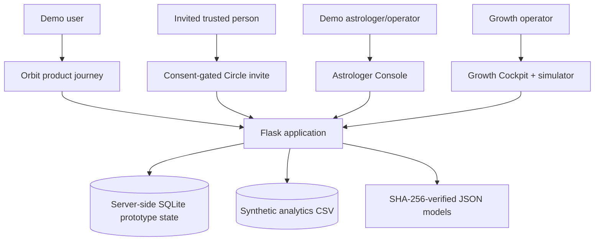
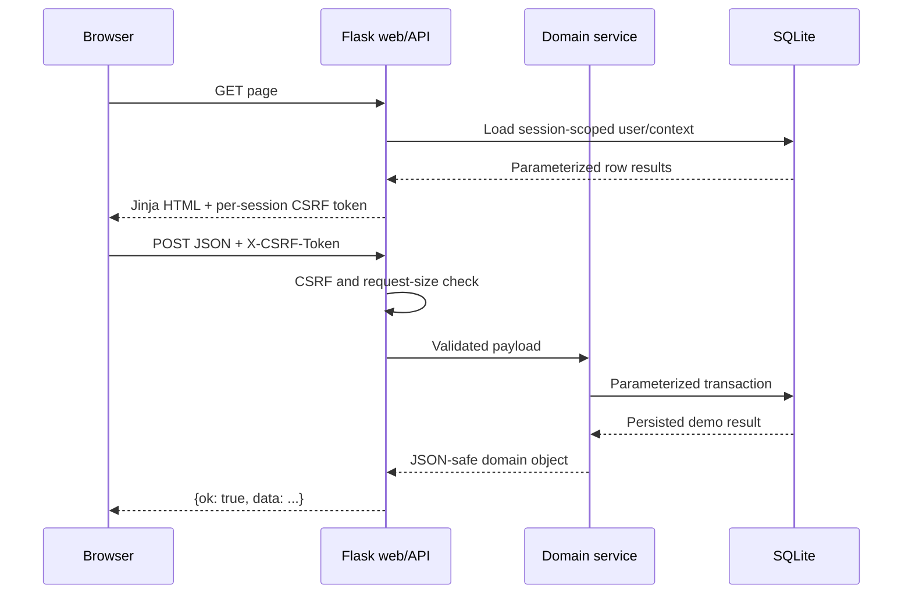
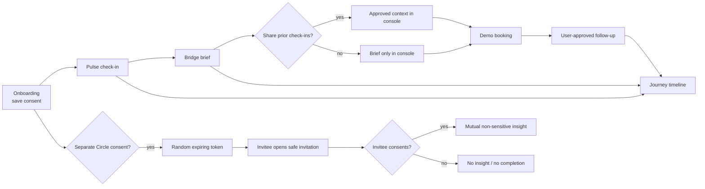
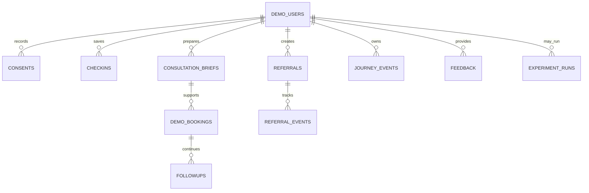
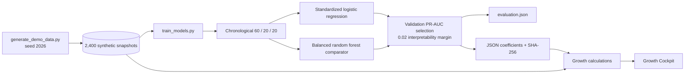
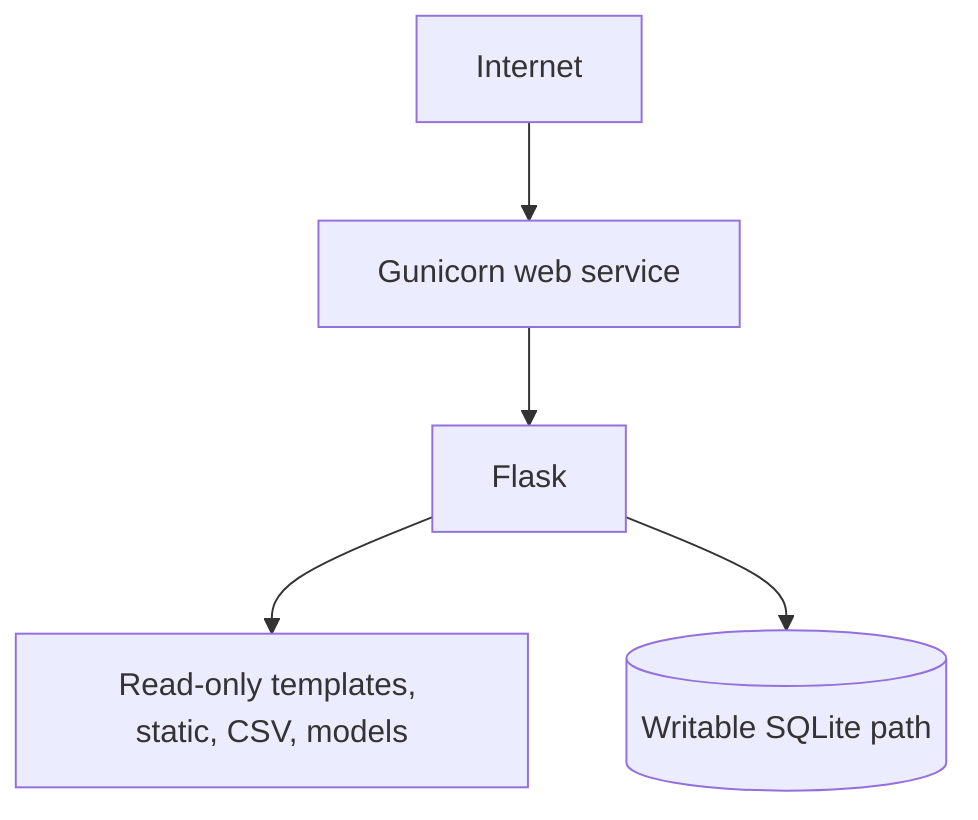

# Architecture

AstroLive Orbit is a server-rendered Flask application designed to run locally or as one small WSGI service without paid APIs. The architecture favors inspectable rules, explicit consent boundaries, standard-library persistence, compact model artifacts, and graceful fallback.

## System context

There is no external astrology, AI, payment, messaging, or booking dependency. All visible transactions are marked as demonstrations.

## Runtime components

| Layer | Location | Responsibility |
|---|---|---|
| Application factory | `app/__init__.py` | Configuration, instance/database initialization, blueprints, CSRF, security headers, error handling |
| Web routes | `app/routes/web.py` | Server-rendered landing, product, Circle, operator, experiment, and privacy pages |
| JSON API | `app/routes/api.py` | Interactive mutations, analytics, simulator, downloads, health response, consistent errors |
| Journey service | `app/services/journey.py` | User creation, consent, deterministic sun sign/reflections, check-ins, streak, timeline, reset |
| Consultation service | `app/services/consultations.py` | Brief validation, user approval, context filtering, sample booking, follow-up |
| Referral service | `app/services/referrals.py` | Random tokens, expiry, invite events, rate limit, dual consent, safe response view |
| Experiment service | `app/services/experiments.py` | Validated assumptions, seeded Monte Carlo simulation, uncertainty and sensitivity, persistence |
| Growth adapter | `app/services/growth.py` | Dashboard snapshot and honest empty/fallback states |
| Analytics | `app/analytics/` | Pure funnel, cohort, retention, K-factor, segment, distribution, and drill-down calculations |
| ML inference | `app/ml/` | Feature contract, leakage deny-list, JSON artifact integrity checks, conservative fallback |
| Persistence | `app/db.py` | Parameterized SQLite access and idempotent schema |
| UI | `app/templates/`, `app/static/` | Semantic Jinja templates, handcrafted CSS, vanilla JavaScript |
| Offline pipeline | `scripts/` | Deterministic synthetic data and scikit-learn training; report/evaluation scripts when finalized |

## Product request flow

All state-changing requests require the token stored in the user’s signed session. Browser JavaScript sends it as a header for JSON APIs; the progressive HTML onboarding form sends the same value in a hidden field. Service functions perform field length, type, date, and allowed-value validation. Expected API failures, including 405 and 413 responses, return structured JSON; production errors do not expose stack traces.

## Closed-loop data flow

Birth details, concerns, check-in text, and database identifiers are never placed in referral URLs. `safe_referral_view` returns only inviter name, status, and expiry by default. The invite form asks only for independent consent and a broad conversation preference; it does not request guest name, mood, birth detail, or free text. The winning completion response returns only the fixed non-sensitive mutual insight. Completed-link GETs close the form, and losing or replayed completion POSTs return redacted consumed status.

Circle creation and consent changes use SQLite `BEGIN IMMEDIATE` transactions and re-check the authoritative consent row. Completion uses a conditional update restricted to active, unexpired, currently consented links, so concurrent submissions create one completion event and one insight response. The first serialized create/revoke operation wins, while the final revoked state cannot leave an active link behind.

## Persistence model

SQLite initializes with `CREATE TABLE IF NOT EXISTS`, foreign keys, constraints, and cascade rules.

The signed browser session stores the demo user ID, CSRF token, and a stable random experiment-owner nonce. The nonce is seeded when `/experiments` renders, before concurrent POSTs can race cookie updates, and is persisted with each experiment row. Downloads query by both run ID and owner nonce and send `private, no-store`; sequential IDs alone do not authorize access. Reset deletes all rows for the current owner nonce (including anonymous pre-onboarding runs) before deleting the user and clearing the session.

## Analytics and ML flow

Only cutoff-time behavioral fields enter training. Named future/outcome fields are denied by the feature contract. The application never deserializes pickles: it verifies the digest, validates artifact format and exact feature order, and performs logistic scoring with NumPy. Missing, tampered, malformed, or incompatible artifacts return `model_available: false` and assign no automated action.

The dashboard hashes synthetic IDs before drill-down, caps row count, labels provenance, and separates descriptive rule-based segments from supervised scores.

## Experiment flow

The simulator validates every editable assumption against bounds, creates a seeded NumPy generator, runs 10,000–100,000 trials, and reports mean, median, 5th, and 95th percentiles. Revenue is omitted unless the user supplies a positive revenue assumption. POSTs are limited to six starts per minute per process/IP and two concurrent runs. Persisted rows expire after 24 hours and are capped to 25 per owner. JSON and CSV exports include assumptions, uncertainty bands/results, and sensitivity evidence. See [Experimentation](EXPERIMENTATION.md).

## Security boundaries

- `ORBIT_SECRET_KEY` is environment-driven; an ephemeral fallback emits a development warning.
- Cookie flags: HTTP-only, SameSite=Lax, optional Secure; eight-hour permanent-session lifetime.
- Maximum request body: 64 KiB.
- Security headers: CSP, frame denial, MIME sniffing protection, restrictive permissions policy, referrer policy, and production HSTS.
- Personalized owner pages send `Cache-Control: private, no-store`; referral-token pages additionally use `Referrer-Policy: no-referrer`.
- SQL values are parameterized; expected choices and lengths are constrained server-side.
- Referral tokens use `secrets.token_urlsafe(32)`, expire after 168 hours, and have per-process/IP lightweight rate limiting.
- Model paths accept fixed task names inside one configured directory; artifacts require matching SHA-256 sidecars.
- Health derives model availability from those integrity-checked loaders and reports degraded status when either required artifact is unavailable or tampered, even if SQLite is healthy.
- No `eval`, pickle loading, credential collection, actual payment, or third-party API call is required.

The in-memory rate limiter is intentionally lightweight: it is not shared between workers and resets on process restart. A production design would use a shared store and stronger abuse monitoring.

## Deployment topology

Local development writes `instance/orbit.db`. The supplied free Render configuration writes `/tmp/orbit.db`, which is ephemeral. For a persistent single-instance demo, attach a disk at `/var/data` and set `ORBIT_DATABASE=/var/data/orbit.db`. SQLite must not be treated as a horizontally scalable write store; production scale requires a managed relational database, shared rate limiting, migrations, backups, and observability.

## Failure and fallback behavior

| Failure | User-visible behavior |
|---|---|
| No current demo user | Protected journey page redirects to onboarding; API returns an authentication-style validation error |
| Missing analytics CSV | Growth Cockpit returns a labeled no-data state and does not infer KPIs |
| Missing/tampered model | Probability/action suppressed with `model_available: false`; deterministic product flows continue |
| Invalid/expired Circle token | Safe 404/410 invitation state; no private data disclosed |
| Invalid input | Field-level message with no database mutation |
| Simulator revenue input is zero | Revenue output is omitted |
| Unexpected production error | Generic error response/page; detail remains in server logs |

## Scaling path

1. Validate the loop locally with synthetic data and consent usability tests.
2. Pilot with explicitly consented event instrumentation and a small astrologer cohort.
3. Replace SQLite with managed Postgres, the local limiter with a shared store, and add migrations/audit logging.
4. Retrain only on governed production outcomes after leakage, calibration, fairness, and intervention review.
5. Scale WSGI instances behind a load balancer, with queues for non-interactive analytics/report work.

This path preserves the human-guidance boundary: behavioral models may prioritize outreach or preparation, but must not generate astrological claims or high-stakes advice.
