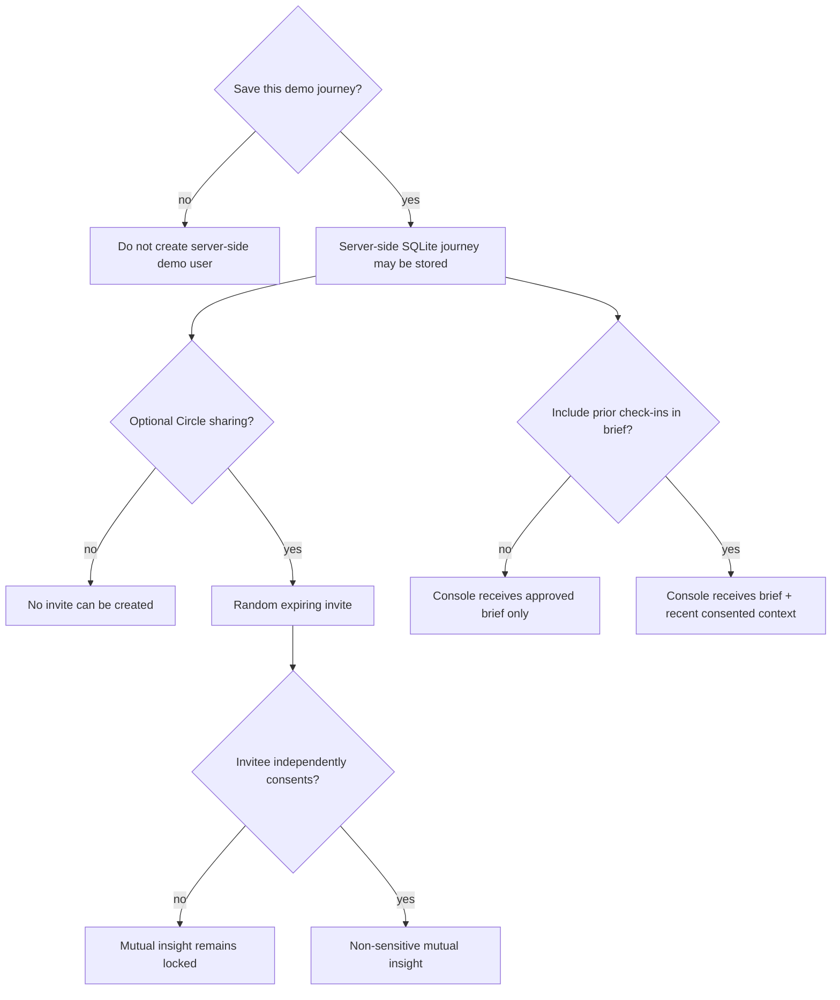

# Privacy, Trust, and Responsible Astrology

AstroLive Orbit treats intimate guidance context as user-controlled information. This prototype is not a production privacy certification, but its product and technical boundaries are designed to demonstrate specific, testable safeguards.

## Responsible-use position

Orbit provides reflective prompts and workflow support. It does not scientifically validate astrology, guarantee outcomes, replace professional judgment, diagnose a condition, or provide medical, legal, financial, safety, employment, credit, or insurance advice.

Human astrologers remain the consultation providers. Behavioral ML may estimate disengagement or consultation intent; it must not predict destiny, compatibility, personality, mental health, protected traits, or the truth of an astrological claim.

## Data classification

| Data | Why used | Sensitivity | Prototype handling |
|---|---|---|---|
| Owner display name | Friendly demo and invitation attribution | Personal | Stored in server-side SQLite; shown to the owner and on their invitation page |
| Guest conversation preference | Select a broad Circle suggestion | Low-sensitivity preference | Processed transiently; only completion state and the deterministic insight are retained; no guest name, mood, birth detail, or free text is requested |
| Birth date | Deterministic sun-sign demo | Personal | Stored in server-side SQLite; never placed in referral link; no full Kundli claim |
| Optional birth time/city | Demonstrate minimal optional onboarding | Potentially sensitive/linkable | Optional, stored server-side, not used for hidden inference or shared by Circle |
| Focus area | Tailor deterministic reflection/specialty | Potentially sensitive | Stored server-side; used transparently; never included in invite URL |
| Mood, confidence, concern | Pulse and optional consultation context | Intimate | Stored server-side only with journey consent; shared to Console only via a separately approved frozen snapshot |
| Brief and questions | Prepare human consultation | Intimate | User edits/approves; Console receives only approved content |
| Booking/follow-up | Demonstrate continuity | Personal | Clearly fictional transaction; server-side prototype storage only |
| Circle token/events | Private invitation and aggregate loop metrics | Security/behavioral | Stored server-side; random token, expiry, event types only; no private context in URL |
| Synthetic analytics CSV | Dashboard and ML demonstration | Non-personal | Fictional IDs and generated behavior; explicitly labeled synthetic |

The public synthetic dataset contains no real names, contact information, birth details, locations, free text, or AstroLive records.

## Consent map

The choices are independent:

- saving is required only because the product journey itself persists;
- Circle sharing is optional and can be changed;
- consultation-context sharing is made when preparing a brief;
- the invitee must consent independently before completing a check-in;
- both sides’ consent is required before a mutual insight is returned.

Consent records are state in the demo, not proof that copy alone would meet every production jurisdiction’s legal requirements.

## Circle non-disclosure boundary

A referral URL contains only a high-entropy random token. It does not contain a database user ID, name, birth detail, focus, mood, concern, brief, or campaign profile. The public invitation view returns only inviter display name, status, and expiry. The form requests only consent and a broad conversation preference; no guest name, mood, birth detail, or free text is collected. The winning completion response returns a fixed, non-sensitive mutual reflection. Later GETs close the form, while losing concurrent or replayed POSTs reveal no reflection or guest input.

Tokens expire after seven days. Invalid and expired tokens return safe error states; owner withdrawal revokes active links. A request carrying the inviter's authenticated demo session cannot complete that inviter's link. Creation/open/completion endpoints have lightweight per-process IP limits, and throttled public pages return 429 with `Retry-After`. A production system still needs distributed rate limiting, durable revocation/audit controls, anomaly detection, and notification controls.

## Content safety

Pulse content comes from fixed templates keyed only by the chosen focus and current mood. Each card explains that choice and explicitly says no birth-chart inference was used. Micro-actions are small and reversible—for example, writing down a decision or listening before responding.

Production content standards should prohibit:

- certain or fatalistic predictions;
- fear, shame, urgency, dependency, or expensive-remedy pressure;
- diagnosis or treatment advice;
- investment, credit, legal, immigration, or safety instructions;
- claims that a user is cursed, doomed, incompatible, or responsible for harm;
- targeting based on grief, illness, abuse, addiction, minors, or crisis signals;
- discouraging professional or emergency help.

When user text suggests immediate danger, the safe product response is crisis-oriented support and escalation—not astrological interpretation.

## Behavioral ML safeguards

The two demo classifiers are trained only on fictional generated outcomes. Their allowed purpose is product research:

- `churn_risk`: estimate future disengagement for benign support prioritization;
- `consultation_intent`: estimate near-term product intent for optional preparation entry.

Guardrails:

- feature contract excludes named future outcomes and protected traits;
- chronological split limits temporal leakage;
- thresholds are chosen from validation costs, not test labels;
- evaluation includes PR-AUC, ROC-AUC, precision, recall, F1, Brier score, and confusion matrix;
- model artifacts are fixed-schema JSON with SHA-256 verification, never pickle;
- missing/tampered models produce no automated assignment;
- scores are not exposed as destiny or user worth;
- no autonomous messaging, pricing, exclusion, or high-stakes decision follows a score.

The synthetic models have only modest holdout discrimination and precision. The churn threshold favors recall and produces many false positives; consultation intent remains insufficient for automated targeting. Neither model is production-ready. Real deployment would require consented representative data, calibration, subgroup/error analysis, intervention testing, documentation, and human override.

## Security implemented in the prototype

- environment-based secret with a visible fallback warning;
- HTTP-only, SameSite cookies and optional Secure flag;
- per-session CSRF token for API mutations and progressive HTML onboarding;
- 64 KiB request limit and server-side validation/length bounds;
- parameterized SQL, foreign keys, and ownership-scoped updates;
- restrictive CSP, frame denial, MIME protection, permissions policy, referrer policy, and production HSTS;
- generic production error responses;
- repository-contained, digest-checked JSON models;
- full current-user reset with explicit confirmation and cascade deletion;
- private/no-store caching for all session-bearing HTML and session-scoped experiment exports.

## Data retention and deletion

Prototype records are stored in server-side SQLite, not on the user’s device. While the signed browser session remains available, reset deletes its experiment runs first, then its current `demo_users` row and cascaded consents, check-ins, briefs, bookings, follow-ups/actions, referrals/events, journey events, and feedback; session state is then cleared.

The signed session expires after eight hours and there is no login or recovery flow. If the cookie is lost or expires while server-side rows survive, the prototype cannot reconnect the person to those rows or offer deletion through the UI. This is a known hackathon limitation, not a production retention design.

On the supplied free Render configuration, SQLite lives in `/tmp` and can disappear during restart or deploy. Ephemerality is not a substitute for a production retention policy: a real service requires stated retention periods, backup deletion, verified account deletion, processor contracts, and recovery controls.

## Known limitations and next controls

- Signed client cookies protect integrity but do not provide user authentication beyond this demo session. A stable random session-owner nonce scopes experiment rows and exports; the nonce is not a user account and is lost with the session.
- The prototype can block self-completion only while the inviter's signed session is present. An inviter who opens their own token anonymously is indistinguishable from the intended recipient; production needs authenticated identities, recipient or channel binding, and abuse monitoring without placing identity data in the URL.
- The in-memory rate limiter is not shared across workers and can be bypassed across instances.
- SQLite lacks the operational controls expected for a multi-tenant production service.
- No encryption-at-rest layer, key rotation, audit-log review, DLP, or penetration test is claimed.
- Optional birth time/city are stored even though the prototype does not use them for a full chart; a production minimization review should remove or justify each field.
- User-provided free text is escaped by Jinja in rendered pages, but browser and security testing must still verify every output context.
- Legal compliance, age policy, accessibility, incident response, and cross-border processing require specialist review before production.

## Review checklist before any real-data pilot

- complete a data-protection impact assessment;
- define event schemas, lawful basis, consent withdrawal, and retention;
- remove unneeded fields and document every downstream consumer;
- add authentication, authorization, audit logs, shared rate limits, encryption, backups, and secret rotation;
- run security, accessibility, abuse, content-safety, and deletion tests;
- evaluate model calibration/errors across relevant groups without inferring protected traits;
- create an astrologer code of conduct and user reporting/escalation path;
- clearly distinguish reflection, entertainment, and professional advice boundaries;
- obtain legal/privacy and domain-expert approval.
